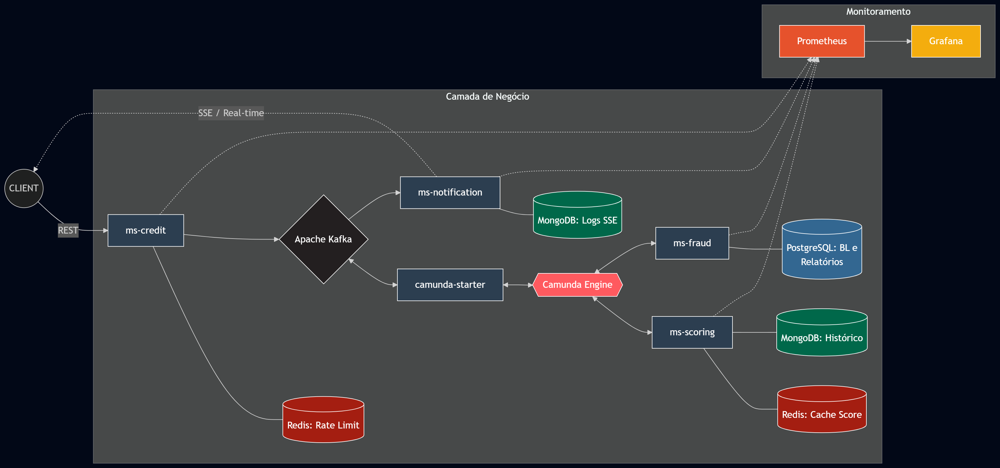
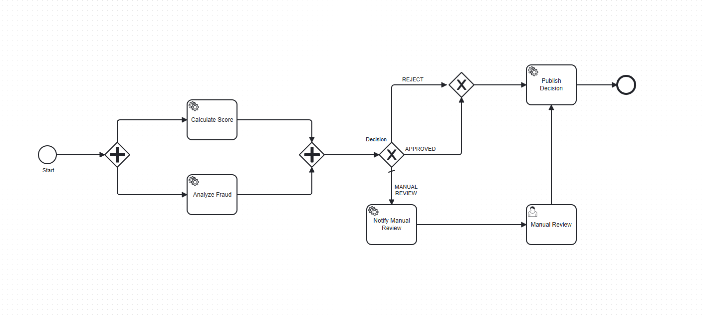
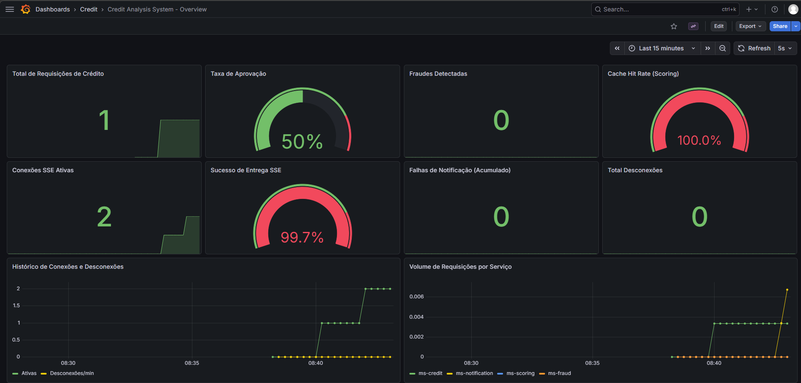

# 🛡️ Credit Analysis System - MVP

Este projeto é um ecossistema de microsserviços voltado para a **Análise de Crédito em tempo real**, focado em alta disponibilidade, resiliência e observabilidade. O sistema utiliza uma arquitetura orientada a eventos e orquestração de processos para gerenciar o ciclo de vida de propostas de crédito.

---

## 🏗️ Arquitetura e Tecnologias

O sistema utiliza padrões arquiteturais modernos para garantir desacoplamento e escalabilidade:

*   **Java 21 & Spring Boot 3.4+**: Core da aplicação.
*   **Apache Kafka**: Mensageria assíncrona entre serviços.
*   **Camunda BPM**: Orquestrador de processos (BPMN).
*   **Redis**: Cache de Scoring e Rate Limit (Segurança).
*   **PostgreSQL**: Dados relacionais e auditoria de fraude.
*   **MongoDB**: Histórico de notificações e alta disponibilidade de escrita.
*   **Prometheus & Grafana**: Monitoramento e métricas em tempo real.
*   **Server-Sent Events (SSE)**: Feedback instantâneo para o front-end.

### 🧩 Microsserviços e Design Patterns
*   **ms-credit**: Porta de entrada. Aplica **Rate Limit** com Redis.
*   **ms-fraud**: Motor de segurança. Usa **Chain of Responsibility** para validações de Blacklist e Renda.
*   **ms-scoring**: Motor de crédito. Usa **Strategy Pattern** para cálculos de score e cache em Redis.
*   **ms-notification**: Entrega de resultados e histórico com **Handshake SSE** via MongoDB.
*   **camunda-starter**: Ponte de eventos entre Kafka e o motor de processos.




---

## 🚀 Como Executar o Projeto

### Pré-requisitos
*   Docker e Docker Compose.
*   Java 21 (LTS).
*   IDE (IntelliJ IDEA recomendada).
*   **Camunda Modeler** (Download: [Camunda](https://://camunda.com/)).

### 1. Subir a Infraestrutura (Docker)
Na raiz do projeto, execute o comando para subir os bancos e ferramentas de mensageria:
```bash
docker-compose up -d
````
Certifique-se de que os containers do Postgres, Mongo, Redis, Kafka e Camunda estejam "Running".
## 2. Deploy do Fluxo no Camunda (Importante!)

O Camunda Modeler é a ferramenta necessária para desenhar e publicar o fluxo BPMN no motor de processos. Como o sistema é orquestrado, os microsserviços dependem que o fluxo esteja deployado para saberem quando atuar (External Tasks).

**Como fazer o deploy:**
1. Abra o Camunda Modeler.
2. Abra o arquivo `.bpmn` localizado em `/camunda/src/main/resources`.
3. Clique no ícone de Foguete (**Deploy Current Diagram**).
4. Configure o REST Endpoint para: `http://localhost:8080/engine-rest`.
5. Clique em **Deploy**. *Sem este passo, o sistema receberá as propostas, mas o processo não será iniciado.*




## 3. Executar os Microsserviços

Na sua IDE, execute a classe principal de cada serviço na ordem sugerida:
- **ms-credit** (Porta 8081)
- **ms-fraud** (Porta 8083)
- **ms-scoring** (Porta 8082)
- **ms-notification** (Porta 8084)
- **camunda-starter** (Porta 8085)

---

## 🧪 Como Testar (Fluxo E2E)

### 1. Monitoramento em Tempo Real
Abra o arquivo `index.html` (Front-end de auditoria) no seu navegador e conecte-se com o ID: `customer-vip-001`.

### 2. Disparar Solicitação (Postman)
Envie um `POST` para `http://localhost:8081/api/v1/credit-requests`:

```json
{
  "customerId": "customer-vip-001",
  "amount": 10000.00,
  "installments": 24,
  "purpose": "PERSONAL",
  "cpf": "32145322040",
  "declaredIncome": 13000.00
}
```
### 3. Validar Resultados
- **SSE:** O resultado da análise aparecerá instantaneamente no monitor HTML.
- **Auditoria:** Pesquise pelo ID no histórico do HTML e baixe o Laudo Técnico em PDF gerado pelo motor de fraude.
- **Métricas:** Acesse `http://localhost:3000` (credenciais: `admin`/`admin`) para visualizar os dashboards no Grafana.


---

## 🛡️ Resiliência e Idempotência

- **Idempotência:** O sistema utiliza *Unique Constraints* no banco e verificações no service para evitar duplicidade de laudos em caso de retentativas do Kafka/Camunda.
- **Resiliência:** Implementação de DLQ (Dead Letter Queue) para tratamento de falhas em mensagens críticas.
- **Qualidade:** Cobertura de testes unitários superior a 65% via JaCoCo.

---

## 🔗 Links e Portas Úteis

- **Kafka UI:** [http://localhost:8090](http://localhost:8090)
- **Camunda Cockpit:** [http://localhost:8080](http://localhost:8080)
- **Prometheus:** [http://localhost:9090](http://localhost:9090)
- **Grafana:** [http://localhost:3000](http://localhost:3000)